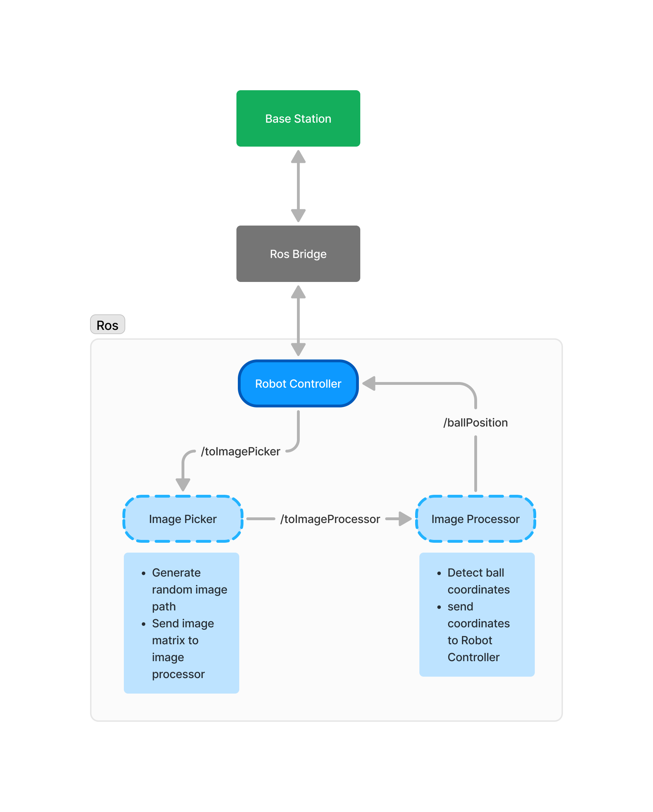

# ROS 1 Final Project
> Name: Yuke Brilliant Hestiavin <br>
> Departement: Computer Engineering <br>
> Nrp: 5024241016

This project is related to the task as an intern software engineer in the Robotics UKM Research Team (IRIS) week 4, Final Project.

## How It Works


## How to Use

### 1. Installation

Clone this repo

```bash
git clone https://github.com/yukebrillianth/FP_Magang.git

cd FP_Magang
```

Build with catkin_make

```bash
source devel/setup.zsh
catkin_make
```

### 2. Usage

compile before run the program
_(run in workspace directory)_

```bash
catkin_make
```

run the rosbridge launcher

```bash
source devel/setup.zsh
roslaunch rosbridge_server rosbridge_websocket.launch
```

open new terminal tab and run controller
```bash
source devel/setup.zsh
rosrun FP_Magang robot_controller
```

open new terminal tab and run image picker
```bash
source devel/setup.zsh
rosrun FP_Magang image_picker
```

open new terminal tab and run image processor
```bash
source devel/setup.zsh
rosrun FP_Magang image_processor
```